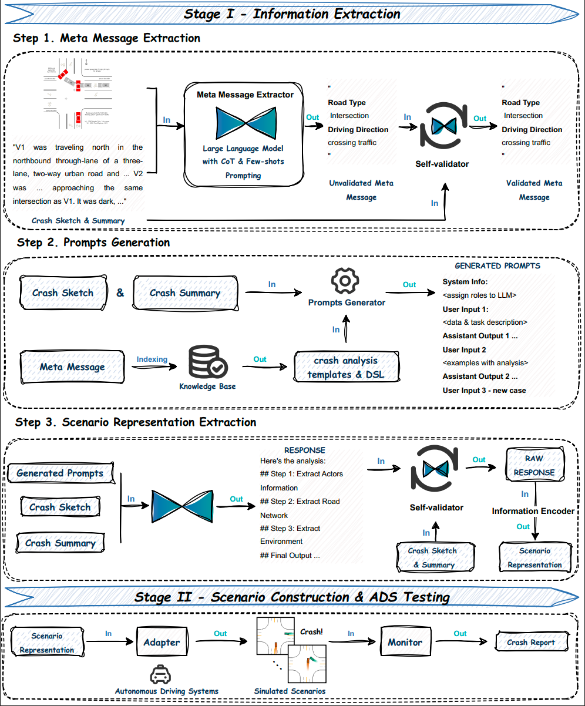

# Scenario-based ADS testing Framework via multimodal Extraction (SAFE)
## Intro
Ensuring the safety of Autonomous Driving Systems (ADS) requires realistic and reproducible test scenarios, yet extracting such scenarios from multimodal crash reports remains a major challenge. Large Language Models (LLMs) often hallucinate and lose map structure, resulting in unrealistic road layouts and vehicle behaviors. To address this, we introduce SAFE, a novel Scenario-based ADS testing Framework via multimodal Extraction, which leverages Retrieval Augmented Generation (RAG), knowledge-grounded prompting, Chain-of-Thought (CoT) reasoning, and self-validation to improve scenario reconstruction from multimodal crash data.

This repository contains the source code for our paper “SAFE: Harnessing LLM for Scenario-Driven ADS Testing from Multimodal Crash Data.”

## SAFE Structure


## Installation Requirements
SAFE leverages multimodal large language models (GPT-4o in the paper) to extract information from crash reports and build ADS test cases across multiple simulators (MetaDrive and BeamNG), thereby uncovering ADS bugs. To deploy SAFE, clone this repository and configure the environment, the GPT API, MetaDrive, and BeamNG.

### Step 1. Obtain OpenAI API Key
SAFE requires access to OpenAI’s API for LLM-based extraction. Obtain an API key from OpenAI and configure your environment variable:
```bash
export OPENAI_API_KEY="your_api_key_here"
```

More info about how to set up the OpenAI API, please refer to the official documentation: [OpenAI API](https://platform.openai.com/docs/api-reference/introduction)

### Step 2. Install MetaDrive Simulator
MetaDrive is one of the supported simulation environments for SAFE. Follow the installation guide at: [MetaDrive GitHub](https://github.com/metadriverse/metadrive)

### Step 3. Install BeamNG and Apply for an Academic License
BeamNG is another supported simulation environment. Apply for an academic license and follow the installation guide at: [BeamNGpy GitHub](https://github.com/BeamNG/BeamNGpy)

## How to run SAFE?

### Step 1. Meta Message Extraction
Run `Framework/Meta_Message_Extraction.py`. It will analyze the crash reports in the `Crash_dataset` folder, extract the meta messages, and save them to `meta_data_results.pkl`.

### Step 2. Prompts Generation
Run `Framework/Prompts_Generation.py.` The generated prompts will be saved to `./Experiment_results/Prompts_generation_results_{current_time}`.

### Step 3. Scenario Representation Extraction
Run `Framework/Scenario_Representation_Extraction.py`. It uses the prompts created in Step 2 and the DSL to drive the LLM (GPT-4o) to extract the scenario representation from multimodal data (crash reports).

### Step 4. Scenario Construction & ADS Testing
The code for scenario construction and ADS testing is stored in `Framework/ADS_Testing`.